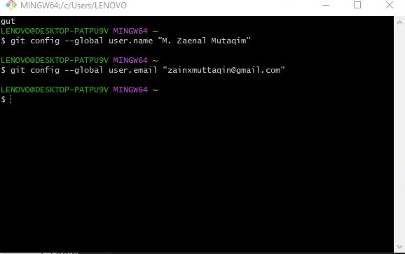
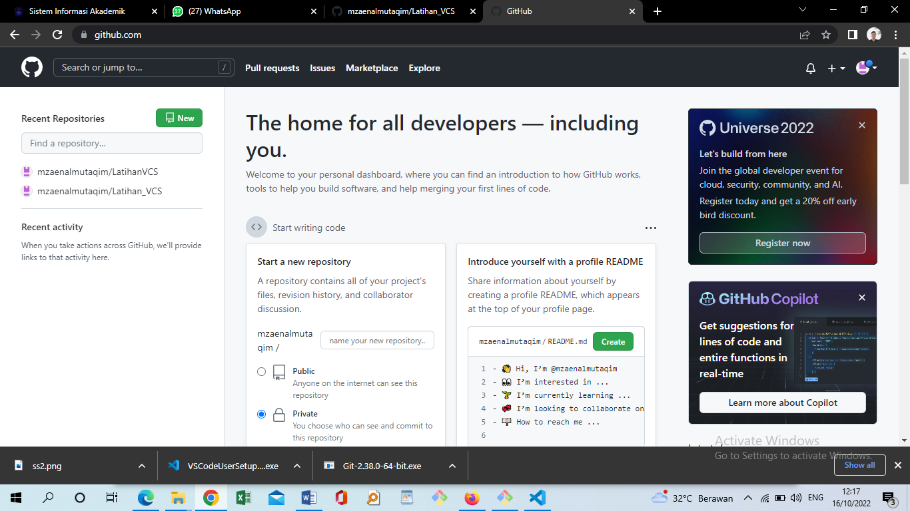
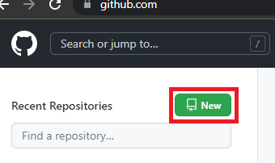
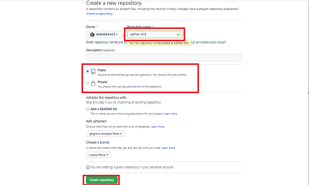
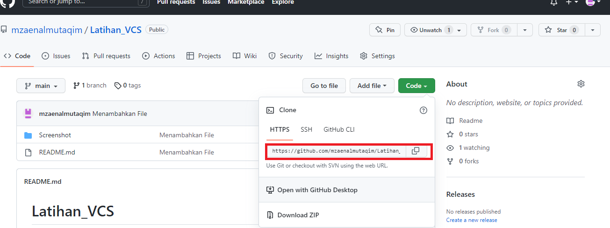
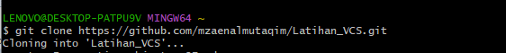
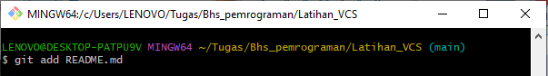
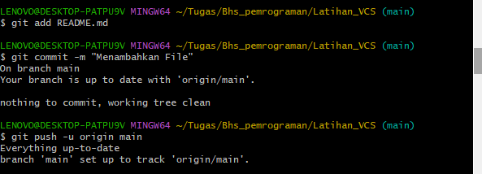
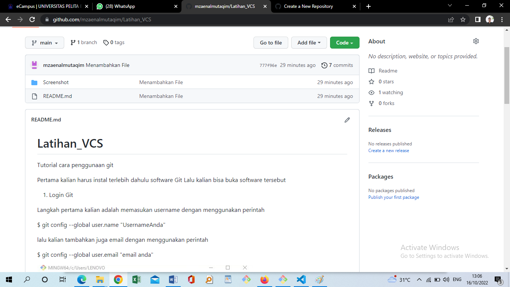

# Latihan_VCS
Tutorial cara penggunaan git

Pertama kalian harus instal terlebih dahulu software Git Lalu kalian bisa buka software tersebut

1.	Login Git

Langkah pertama kalian adalah memasukan username dengan menggunakan perintah

$ git config --global user.name "UsernameAnda"

lalu kalian tambahkan juga email dengan menggunakan perintah

$ git config --global user.email "email anda"

2.	Login Github

Langkah kedua login ke dalam website github, Setelah login maka akan muncul tampilan

dashboard dari github tersebut

3.	Membuat Repository

Setelah berhasil login ke GitHub, Anda bisa mulai membuat repository. Klik tombol New pada menu 

Repositories untuk membuat repository baru.

Kemudian akan muncul halaman seperti gambar dibawah ini

4. Buat folder dengan menggunakan perintah dan buka folder tersebut

$mkdir latihan1

$cd latihan1

Kemudian masuk ke repository yang sudah dibuat seperti gambar berikut dan copy url yang ada didalam

git code

masukan perintah $git clone https://github.com/mzaenalmutaqim/Latihan_VCS.git

Untuk Menambahkan file yang baru dibuat, gunaka perintah $git README.md

Untuk menyimpan perubahan pada repository gunakan perintah

$git commit -m "Menambahkan file"

$git push -u origin main

Kemudian Kita bisa cek di repository

## TERIMAKSIH

follow : 

ig: @zzainly
tiktok: @zzainly
fb: Zainal Muttaqin
yt: belum buat

